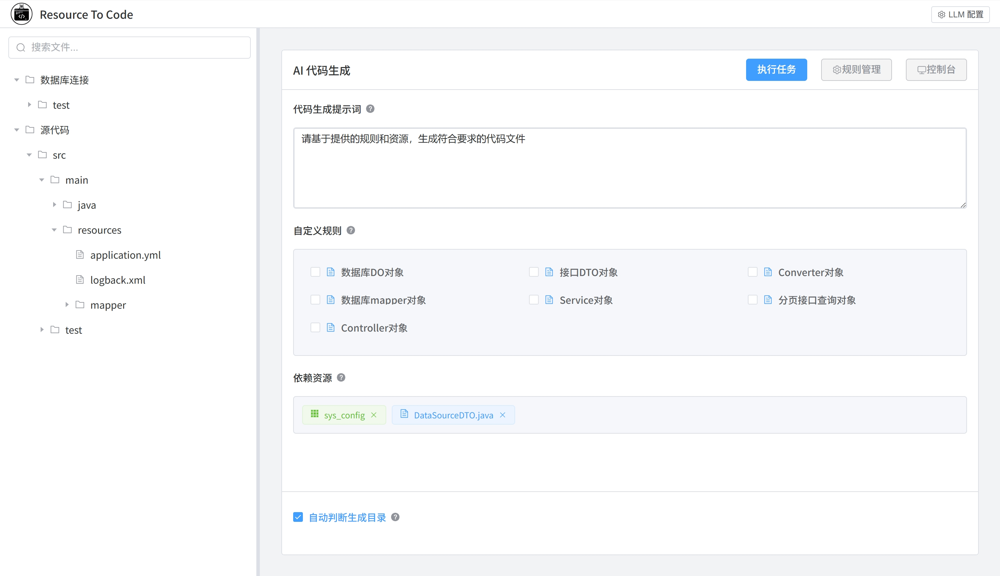

#  resource2code：基于AI大模型的代码生成工具

**resource2code**是一款利用AI大模型和本地资源生成业务代码的生产力工具。它的工作原理很简单：资源 + 规则 + LLM = 代码。

+ **资源**: 可以是任何生成代码依赖的东西：数据库表，API文档，代码文件，配置文档等，resource2code帮你将各种资源转换成LLM易于理解的格式
+ **规则**: 是你对生成代码的要求，比如：代码规范，代码风格，代码示例等，使用markdown格式编写，你可以自由的管理维护各种规则，同时在各个项目中复用你的规则
+ **LLM**: 支持接入自定义的AI大模型，目前支持OpenAI兼容格式以及Ollama两种格式的API

和其它类似的代码助手相比，它的核心优势在于不依赖IDE独立工作，可以自由管理和复用规则，不必每次重复编写提示词，灵活的整合各种外部资源，不用手动复制和编辑



# 快速开始

1. 下载预编译的可执行文件(暂时只提供windows版本)或者下载源码自行编译；
2. 在LLM配置中配置你的AI大模型；
3. 在右侧资源栏配置数据库连接信息和项目工程目录（项目工程目录请选择实际的源码目录src，不要包含过多的无关目录，避免影响LLM判断代码的生成目录）
4. 管理你的代码规则（系统提供了一些默认规则作为参考）
5. 选择任务需要用到的额外的资源，开始生成代码

# 本地编译

整个项目是基于tauri框架的，请首先确保安装rust和pnpm环境。
然后在源码根目录执行以下命令：

```bash
pnpm install
pnpm tauri build
```

欢迎大家关注我的公众号（飞空之羽的技术手札），我会在上面定期分享一些关于技术的经验和感悟~

